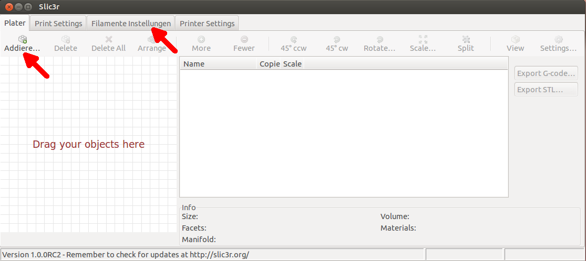

Q: What is your goal?

A: Localize Slic3r [[project homepage]] (http://slic3r.org/) and an acceptance of pull-requet.

Slic3r-i18n
======

### What are Slic3r-i18n's main features?

Key features are:

* Localize messages and GUI texts with GNU Gettext.

### I'm a developper. How to use gettext function?

* You have only to use ``Slic3r::_u``. This function is a wrapper of
  ``Locale::TextDomain::__``.

    sub title { Slic3r::_u('Filament Settings') } # <---

  NOTE: ``Locale::TextDomain::__`` is insuficient for utf-8 character and Wx component. So use ``Slic3r::_u``.

### What are your policy?

```
1 rebase "stable" branch onto upstream.
2 add resource and test well.
3 send pull request.
4 "i18n-stable" in this repo is a stable branch.
  "i18n-pullreq" in this repo is a pull-req branch.
```

### How to install?

Just now there is no precompiled package.
You want to compile the source yourself just do the following:

```
$ git clone https://github.com/KouOuchi/Slic3r-i18n.git
$ cd Slic3r
$ sudo perl Build.PL
$ sudo perl Build.PL --gui --i18n
$ LC_ALL=ru_RU.UTF-8 perl slic3r.pl --gui
```

### Can I help?

Let's translate into your language.

### How can I add my mother tongue?

Add your language code to utils/i18n/gettext.pl.

$ gedit utils/i18n/gettext.pl

    my(@LOCALE_LIST)=("de", "fr", "it", "pt", "ru", "zh_CN", "nl", "es", "lv", "ja"); # <--- Add here.

NOTE: If you don't know your language code, please see gettext website.

Run it.
```
$ sudo perl utils/i18n/gettext.pl
```

### How can I modify our language resource?

Run it.
```
$ sudo perl utils/i18n/gettext.pl
```

Edit .po(gettext resource) file. NOTE: To edit .po file you should get suitable
editor. e.g. poedit/emacs.
```
$ poedit var/po/slic3r-ru.po
```

Run utils/i18n/gettext.pl again. You get .mo(gettext catalogue) file.
```
$ sudo perl utils/i18n/gettext.pl
```

Finally, set language environment value(LC_ALL) to your language code.
```
$ LC_ALL=ru_RU.UTF-8 perl slic3r.pl --gui
```

### Screen Shot

## de
```
$ LC_ALL=de_DE.UTF-8 perl slic3r.pl --gui
```


## es
```
$ LC_ALL=es_ES.UTF-8 perl slic3r.pl --gui
```


## fr
```
$ LC_ALL=fr_FR.UTF-8 perl slic3r.pl --gui
```


## it
```
$ LC_ALL=it_IT.UTF-8 perl slic3r.pl --gui
```


## ja
```
$ LC_ALL=ja_JP.UTF-8 perl slic3r.pl --gui
```


## lv
```
$ LC_ALL=lv_LV.UTF-8 perl slic3r.pl --gui
```


## nl
```
$ LC_ALL=nl_NL.UTF-8 perl slic3r.pl --gui
```


## pt
```
$ LC_ALL=pt_PT.UTF-8 perl slic3r.pl --gui
```


## ru
```
$ LC_ALL=ru_RY.UTF-8 perl slic3r.pl --gui
```


## zh_CN
```
$ LC_ALL=zh_CN.UTF-8 perl slic3r.pl --gui
```

