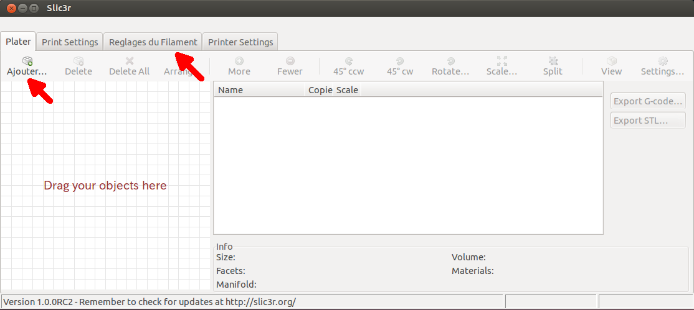
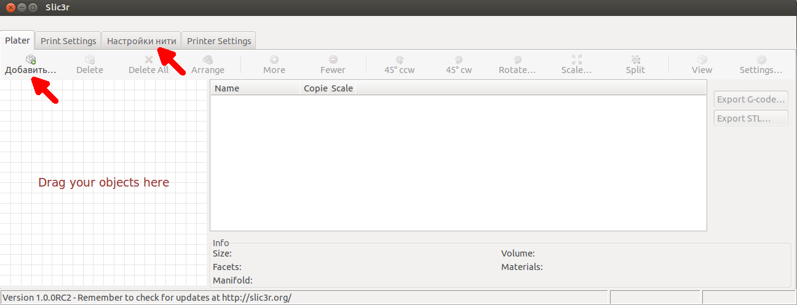

Q: What is your goal?

A: Localize Slic3r [[project homepage]] (http://slic3r.org/) and an acceptance of pull-requet.

Slic3r-i18n
======

### What are Slic3r-i18n's main features?

Key features are:

* Localize messages and GUI texts with GNU Gettext.

### I'm a developper. How to use gettext function?

* You have only to use ``Slic3r::_u``. This function is a wrapper of
  ``Locale::TextDomain::__``.

    sub title { Slic3r::_u('Filament Settings') } # <---

  NOTE: ``Locale::TextDomain::__`` is insuficient for utf-8 character and Wx component. So use ``Slic3r::_u``.

### What are this repo's policy?

```
1 rebase "stable" branch onto upstream.
2 add resource and test well.
3 send pull request.
4 "i18n-stable" in this repo is a stable branch.
  "i18n-pullreq" in this repo is a pull-req branch.
```

### How to install and run on Linux?

Just do the following:

```
$ git clone https://github.com/KouOuchi/Slic3r-i18n.git
$ cd Slic3r-i18n
$ sudo perl Build.PL
$ sudo perl Build.PL --gui --i18n
$ LC_MESSAGES=ja_JP.UTF-8 perl slic3r.pl --gui --gui-mode expert --no-plater
```

### How to install and run on Windows?

Compiled binary is 

#### Prerequisite on Windows

1. strawberry-perl-5.14.4.1-64bit-portable.zip
2. msys+7za+wget+svn+git+mercurial+cvs-rev13.7z

NOTE: strawberry-perl-5.14.4.1 includes Mingw64 compiler.
NOTE: Citrus perl has no FREEGLUT binaries. So strawberry is better.
NOTE: perl version is required just 5.14x.
NOTE: I install manually below cpanm packages:
      Wx, Alien::WxWidgets

#### Building and run on Windows

```
$ git clone https://github.com/KouOuchi/Slic3r-i18n.git
$ cd Slic3r-i18n
<<<run strawberry perl terminal>>>
$ perl Build.PL
$ perl Build.PL --gui --i18n
$ set LC_MESSAGES=ja_JP
$ perl slic3r.pl --gui --gui-mode expert --no-plater
```

### (NOTE) building gettext manually

To build gettext, get MSYS shell environment(http://www.mingw.org/wiki/Getting_Started).
``Base System``, ``make``, ``xgettext`` are required.

NOTE: You may have to use the same compiler as you use in perl. 

NOTE: You can also install gettext package manually. But I installed it MSYS installer at the same time. 

NOTE: I tested on Windows7 64bit (Sitrus Perl & MinGW). MinGW is installed into /c/Apps/mingw64.

get latest gettext package ``gettext-0.18.3.1-1-mingw32-src.tar.lzma`` from (http://sourceforge.net/projects/mingw/files/MinGW/Base/gettext/gettext-0.18.3.1-1/).
Extract package and run shell script. 

```
$ tar xivf gettext-0.18.3.1-1-mingw32-src.tar.lzma
$ cd gettext-0.18.3.1-1-mingw32
$ tar xzvf gettext-0.18.3.1.tar.gz
$ cd gettext-0.18.3.1
$ patch < ../config.sub.patch
$ export PATH=/c/Apps/mingw64/bin:$PATH
$ ./configure --prefix=/c/Apps/mingw64 \
     --host=x86_64-w64-mingw32 --build=x86_64-w64-mingw32 
$ make
$ make install
```

### Can I help?

Let's translate into your language.

### How can I add my mother tongue?

Add your language code to utils/i18n/gettext.pl.

$ gedit utils/i18n/gettext.pl

    my(@LOCALE_LIST)=("de", "fr", "it", "pt", "ru", "zh_CN", "nl", "es", "lv", "ja"); # <--- Add here.

NOTE: If you don't know your language code, please see gettext website.

Run it.
```
$ sudo perl utils/i18n/gettext.pl
```

### How can I modify our language resource?

Run it.
```
$ sudo perl utils/i18n/gettext.pl
```

Edit .po(gettext resource) file. NOTE: To edit .po file you should get suitable
editor. e.g. poedit/emacs.
```
$ poedit var/po/slic3r-ru.po
```

Run utils/i18n/gettext.pl again. You get .mo(gettext catalogue) file.
```
$ sudo perl utils/i18n/gettext.pl
```

Finally, set language environment value(LC_MESSAGES) to your language code.
```
$ LC_MESSAGES=ru_RU.UTF-8 perl slic3r.pl --gui
```

### Screen Shot

## de
```
$ LC_MESSAGES=de_DE.UTF-8 perl slic3r.pl --gui
```


## es
```
$ LC_MESSAGES=es_ES.UTF-8 perl slic3r.pl --gui
```


## fr
```
$ LC_MESSAGES=fr_FR.UTF-8 perl slic3r.pl --gui
```


## it
```
$ LC_MESSAGES=it_IT.UTF-8 perl slic3r.pl --gui
```


## ja
```
$ LC_MESSAGES=ja_JP.UTF-8 perl slic3r.pl --gui
```


on Windows:
```
> set LC_MESSAGES=ja_JP
> perl slic3r.pl --gui --gui-mode expert --no-plater
```


## lv
```
$ LC_MESSAGES=lv_LV.UTF-8 perl slic3r.pl --gui
```


## nl
```
$ LC_MESSAGES=nl_NL.UTF-8 perl slic3r.pl --gui
```


## pt
```
$ LC_MESSAGES=pt_PT.UTF-8 perl slic3r.pl --gui
```


## ru
```
$ LC_MESSAGES=ru_RY.UTF-8 perl slic3r.pl --gui
```


## zh_CN
```
$ LC_MESSAGES=zh_CN.UTF-8 perl slic3r.pl --gui
```

